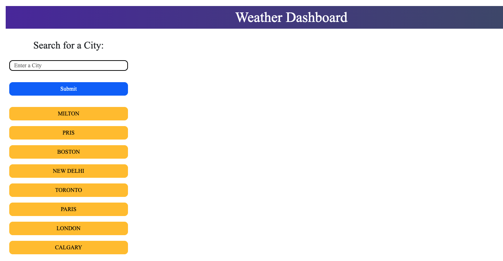
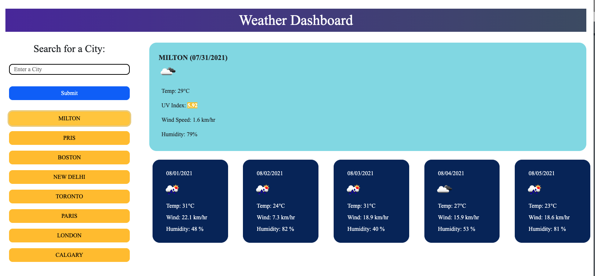

# weather-dashboard

## [weather-dashboard](https://harry-100.github.io/weather-dashboard/)

## [GitHub Url](https://github.com/harry-100/weather-dashboard)

## This is a weather dashboard which can be used to look up weather for city

## Key features include:

* For a given city, current weather and 5-day forecast can be displayed

* It also displays previously searched cities for a quick search

* Search can be done either by entering a city name in the search bar or by clicking city name.

## Screenshots

